<!---
layout: demo
--->
<html lang="cmn-Hans">
<head>
    <title>D3 Fetch</title>
    
    <base target="_blank">
    
</head>
<body>
<header>
    <h1>d3-fetch</h1>
    <address>api地址：https://d3js.org.cn/document/d3-fetch/</address>
</header>

<main>

    <article>

        <section>
            <h3>d3.blob(input[, init])</h3>

            <section>
                <h4>用法1</h4>
                <pre>
                <code>
                    d3.blob('./datas/text.txt').then(data => {
                        console.log('blob', data);
                    });
                </code>
                </pre>
                

                    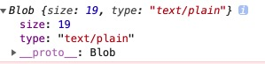
                    
                

            </section>

            <section>
                <h4>用法2</h4>
                <pre>
                <code>
                    d3.blob('./datas/text.txt', {
                        method: 'POST'
                    }).then(data => {
                        console.log('blob', data);
                    });
                </code>
                </pre>
            </section>

        </section>

        <section>
            <h3>d3.buffer(input[, init])</h3>

            <section>
                <h4>用法1</h4>
                <pre>
                <code>
                    d3.buffer('./datas/text.txt').then(data => {
                        console.log('buffer', data);
                    });
                </code>
                </pre>
                

                    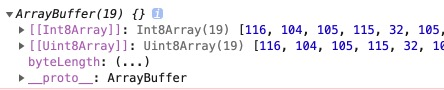
                    
                

            </section>

        </section>
        </section>

        <section>
            <h3>d3.dsv(delimiter, input[, init][, row])</h3>

            <section>
                <h4>用法1</h4>
                <pre>
                <code>
                    d3.dsv(',', './datas/sample.csv').then(data => {
                        console.log('dsv', data);
                    });
                </code>
                </pre>
                

                    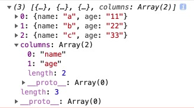
                    
                

            </section>

            <section>
                <h4>用法2</h4>
                <pre>
                <code>
                    d3.dsv(',', './datas/sample.csv', d => {
                        return { name: d.name + '_test', age: d.age };
                    }).then(data => {
                        console.log('dsv', data);
                    });
                </code>
                </pre>
                

                    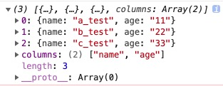
                    
                

            </section>

        </section>

        <section>
            <h3>d3.csv(input[, init][, row])</h3>

            <section>
                <h4>用法1</h4>
                <pre>
                <code>
                    d3.csv('./datas/sample.csv', d => {
                        return { name: d.name + '_test', age: d.age };
                    }).then(data => {
                        console.log('csv', data);
                    });
                </code>
                </pre>
                

                    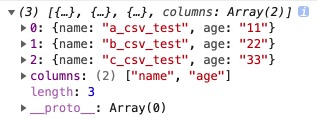
                    
                

            </section>

        </section>

        <section>
            <h3>d3.tsv(input[, init][, row])</h3>

            <section>
                <h4>用法1</h4>
                <pre>
                <code>
                    d3.tsv('./datas/sample.tsv', d => {
                        return { name: d.name + '_test', age: d.age };
                    }).then(data => {
                        console.log('tsv', data);
                    });
                </code>
                </pre>
                

                    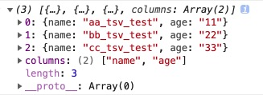
                    
                

            </section>

        </section>
        </section>

        <section>
            <h3>d3.html(input[, init])</h3>

            <section>
                <h4>用法1</h4>
                <pre>
                <code>
                    d3.html('./datas/file.html').then(data => {
                        console.log('html', data);
                        console.log('html body', data.body);
                    });
                </code>
                </pre>
                

                    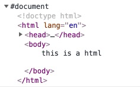
                    
                

            </section>

        </section>

        <section>
            <h3>d3.image(input[, init])</h3>

            <section>
                <h4>用法1</h4>
                <pre>
                <code>
                    d3.image('./screens/Jietu20190705-144527.jpg').then(data => {
                        console.log('image', data);
                        console.log('image src', data.src);
                    });
                </code>
                </pre>
                

                    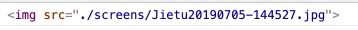
                    
                

            </section>

        </section>

        <section>
            <h3>d3.json(input[, init])</h3>

            <section>
                <h4>用法1</h4>
                <pre>
                <code>
                    d3.json('./datas/sample.json').then(data => {
                        console.log('json', data);
                    });
                </code>
                </pre>
                

                    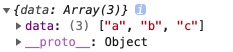
                    
                

            </section>

        </section>

        <section>
            <h3>d3.svg(input[, init])</h3>

            <section>
                <h4>用法1</h4>
                <pre>
                <code>
                    d3.svg('./datas/sample.svg').then(data => {
                        console.log('svg', data);
                    });
                </code>
                </pre>
                

                    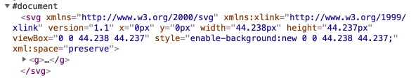
                    
                

            </section>

        </section>

        <section>
            <h3>d3.text(input[, init])</h3>

            <section>
                <h4>用法1</h4>
                <pre>
                <code>
                    d3.text('./datas/text.txt').then(data => {
                        console.log('text', data);
                        document.getElementById('outText').innerText = data;
                    });
                </code>
                </pre>
                

                    

                    
                

            </section>

        </section>

        <section>
            <h3>d3.xml(input[, init])</h3>

            <section>
                <h4>用法1</h4>
                <pre>
                <code>
                    d3.text('./datas/text.txt').then(data => {
                        console.log('text', data);
                        document.getElementById('outText').innerText = data;
                    });
                </code>
                </pre>
                

                    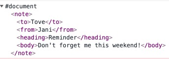
                    
                

            </section>

        </section>

    </article>

</main>

<footer>
    

    <small>CopyRight By I'm Gafish</small>
</footer>
</body>
</html>